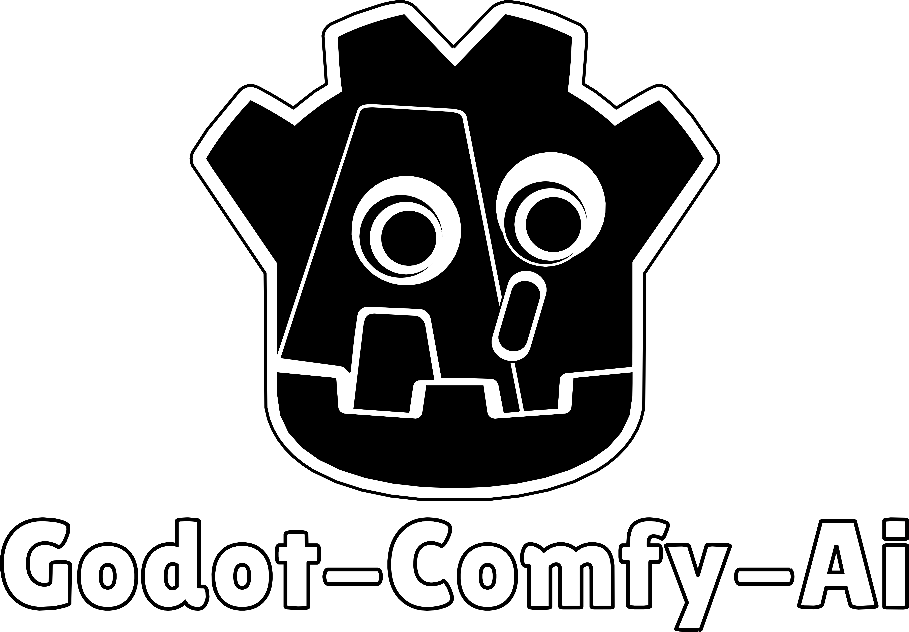
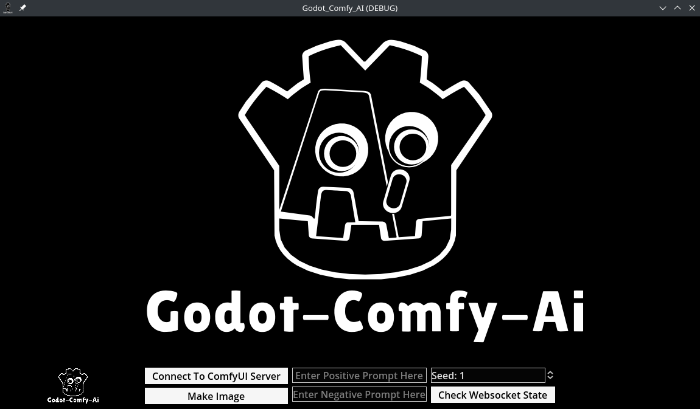
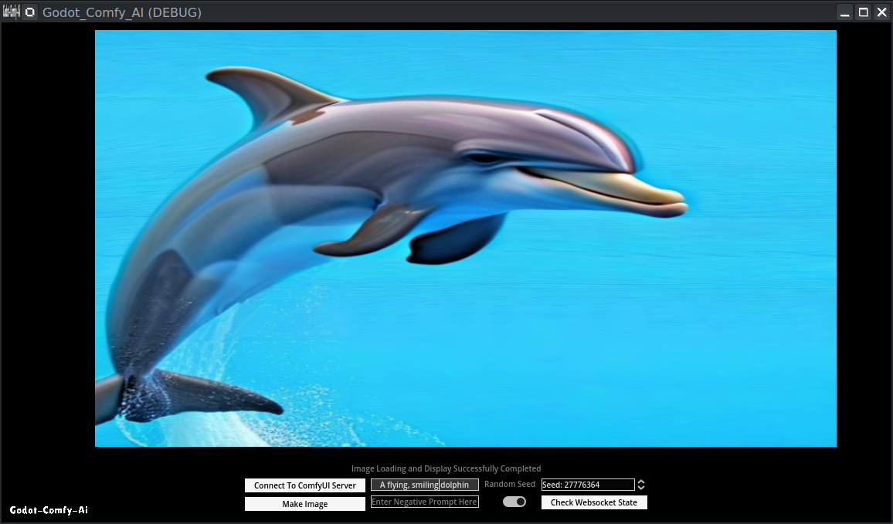

# Godot-Comfy-AI

ComfyUI API implementation in Godot that allows Godot to be used as a front-end for ComfyUI, enabling image and text generation and display over a websocket connection to a locally hosted ComfyUI instance.  

Godot-Comfy-AI demonstrates a simple integration for connecting Godot, the open-source game engine, with ComfyUI, a powerful AI image generation tool, using a WebSocket API. By leveraging ComfyUI's workflow JSON files and API endpoints, you can create dynamic and interactive applications that generate images based on user input or game events.

## Prerequisites

Before using this project, ensure that you have the following:

1. A working installation of ComfyUI on your local machine (using a remote server is a possibility but this implementation is focused on a local install).
2. Godot game engine installed on your development machine.
3. Basic knowledge of Godot and GDScript programming, and some previous experience using ComfyUI.

## Steps to Use the Project

### 1. Set up ComfyUI:

- Install and configure ComfyUI on your local machine or a remote server.
- Create a workflow in ComfyUI that defines the image generation process.
- Save the workflow as a JSON file using the "Save (API Format)" option in ComfyUI (you would need to toggle on ‘enable dev mode options’ under the ComfyUI settings to reveal this button. Note that this ‘Save (API Format)’ button would be a different one from the normal save workflow button and is required to be able to use the JSON as an API.
- Keep the ComfyUI server running all through while working with Godot-Comfy-AI as the implementation is dependent on the server running.

### 2. Prepare the Workflow JSON File:

- Follow the guidance provided in [this video tutorial](https://youtu.be/va8Jkc7o9d4?si=mrGe6_uoDEooaFec) to set up the workflow JSON file from ComfyUI.
- Note that the Python part of the process described in the video can be replaced with the Godot implementation contained in this repository.

### 3. Set up the Godot Project:

- Clone or download the Godot-Comfy-AI repository to your local machine.
- Open the project in Godot.
- Copy the workflow JSON file obtained from ComfyUI into the Godot project's resource folder. A similarly prepared JSON file already exists in the project for testing but you can keep multiple JSON files in your project and just set the path for the one you want to work with in the code.

### 4. Configure the Godot Script:

- Open the `Godot_Comfy_Websocket.gd` script file in Godot.
- Update the `server_address` variable to match the address and port of your ComfyUI server (usually the same as contained in the sample code, but verify this and change to the right one if necessary).
- Modify the `workflow_json_file` variable to point to the location of your workflow JSON file within the Godot project.

### 5. Customize Image Generation:

- In the `_on_generate_image_button_button_down()` function, you can modify the `workflow_json` dictionary to customize the image generation parameters, such as the text prompts, seed value, or other settings. This is already connected to the Godot UI in this sample project, but you can manipulate the settings in code if you prefer.

### 6. Run the Godot Project:

- With ComfyUI already running, press the "Play" button in Godot to run the project.
- Click the appropriate buttons in the Godot application to connect to the server, set a seed for generation, input positive and negative prompts, and initiate the image generation process. Some text prompts should display in the interface to indicate what's going on.
- If all goes well, the generated image will be displayed on the `TextureRect` node in the Godot scene.

### 7. Explore and Expand:

- Experiment with different workflow JSON files and image generation parameters to create various visual outputs.
- Integrate the image generation functionality into your own Godot projects, such as games, interactive applications, or creative tools.

## Troubleshooting

- If you encounter any issues with the WebSocket connection or image generation process, check the Godot output panel and the ComfyUI terminal for error messages and logs. Also review known issues as listed below.
- Ensure that the ComfyUI server is running and accessible at the specified `server_address`.
- Verify that the workflow JSON file is properly formatted and compatible with the ComfyUI version you are using.

By following these steps and leveraging the power of ComfyUI's workflow JSON files and API, you can create innovative and immersive experiences in Godot that harness the potential of AI image generation.

## Built with AI

The code, project set-up, and even the project description here have been assembled through copious prompting with Claude 3 Opus, with support from GPT4 and a couple of other models. Comments and improvements are most welcome from both humans and AI who find the project interesting.

