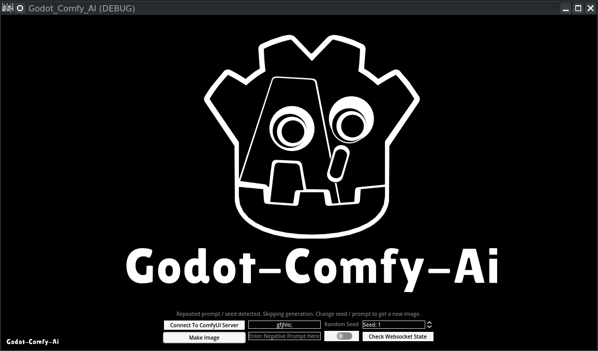

# Godot-Comfy-AI

ComfyUI API implementation in Godot that allows Godot to be used as a front-end for ComfyUI, enabling image and text generation and display over a websocket connection to a locally hosted ComfyUI instance.  

Description to follow......

Issues: 
1. Websocket connection button might have to be clicked twice or thrice in succession for the connection to be established.
2. TCP already in use error from subsequent attempts to connect the websocket after the first successful connection.
3. Seed sometimes defaults to '1' or '10000000000' if entered digits exceed max set in code. Seed value could stall image generation in such instances. Also random seed generation to be added.
4. 'Buffer full while polling websocket' issue from socket.poll() leads to dropped data. [Seems connected to this issue](https://github.com/godotengine/godot/issues/22496). Relevant fix still being sought.
